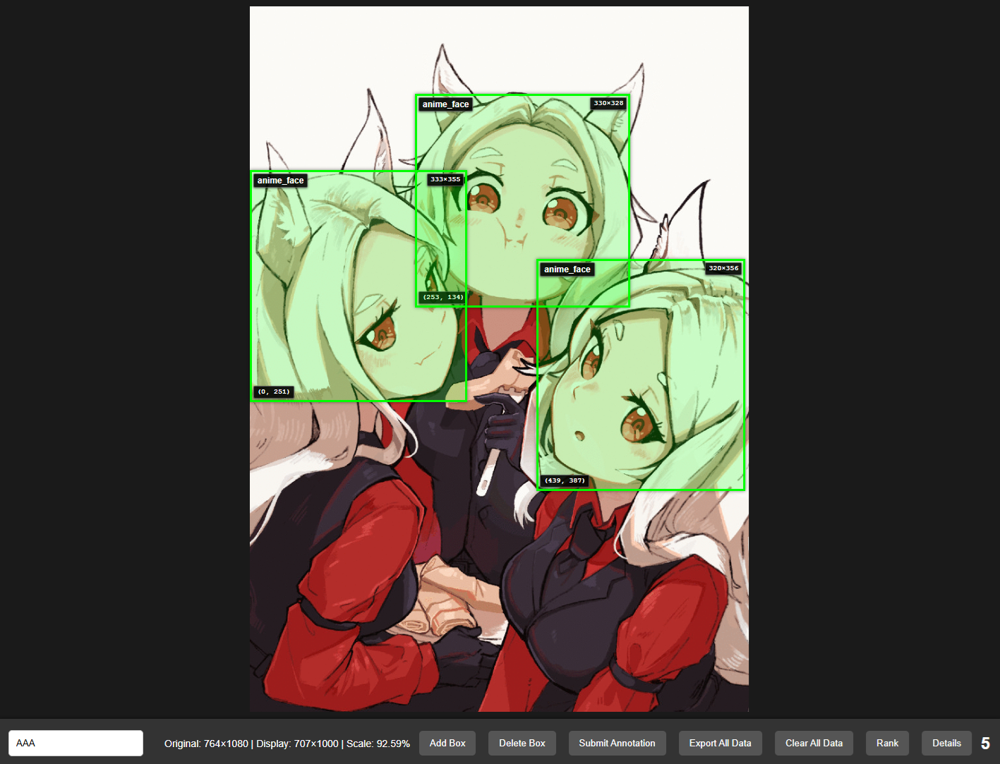

# Image Annotation



A React + Next.js web application for creating bounding box annotations on images. 

## 🚀 Quick Start

### Development
```bash
# Install dependencies
npm install

# Start development server
npm run dev
```
Open [http://localhost:3000](http://localhost:3000)

### Production Build
```bash
# Build for production
npm run build

# Start production server
npm start
```

## 📖 Usage

### Basic Workflow
1. **Auto-Load**: Image loads automatically on startup
2. **Enter Name**: Type your name in the toolbar (left side)
3. **Add Boxes**: Click "Add Box" button - box appears immediately
4. **Adjust**: Drag boxes to move, drag corners to resize
5. **Submit**: Click "Submit Annotation" to save and load next image
6. **Export**: Click "Export All Data" to download JSON file

### Keyboard Shortcuts
- **Delete**: Remove selected box
- **d**: Toggle grid validation overlay

### Button Functions
| Button | Action |
|--------|--------|
| Add Box | Create new bounding box (centered or offset from last) |
| Delete Box | Remove the last box added |
| Submit Annotation | Save current annotation and load next image |
| Export All Data | Download all annotations as JSON |
| Clear All Data | Delete all saved data (with confirmation) |
| Rank | View annotation leaderboard |
| Details | Show help information |

## 📊 Data Format

### localStorage Structure
```json
{
  "annotation_data": {
    "annotation_records": [
      {
        "session_id": "session_1234567890",
        "image_url": "https://cdn.waifu.im/...",
        "original_size": { "width": 1920, "height": 1080 },
        "display_size": { "width": 960, "height": 540 },
        "scale_factor": 0.5,
        "annotator": "your_name",
        "timestamp": "2024-01-01T00:00:00.000Z",
        "bounding_boxes": [
          {
            "id": "box_1234567890_abc",
            "x": 960,
            "y": 540,
            "width": 480,
            "height": 480,
            "label": "anime_face"
          }
        ]
      }
    ],
    "total_images": 1,
    "total_annotations": 1,
    "last_updated": "2024-01-01T00:00:00.000Z"
  },
  "userName": "your_name"
}
```

### Export Format
```json
{
  "export_info": {
    "export_date": "2024-01-01T00:00:00.000Z",
    "total_images": 5,
    "total_annotations": 15,
    "data_range": {
      "first_annotation": "2024-01-01T00:00:00.000Z",
      "last_annotation": "2024-01-01T12:00:00.000Z"
    }
  },
  "annotation_records": [ /* same structure as above */ ]
}
```

## ✅ Feature

| Feature | Status |
|---------|--------|
| Auto-load random image | ✅ |
| Immediate box creation | ✅ |
| Drag to move | ✅ |
| Resize with handles | ✅ |
| Original coordinate storage | ✅ |
| Window resize handling | ✅ |
| Delete last box | ✅ |
| Submit with validation | ✅ |
| Overwrite confirmation | ✅ |
| Export to JSON | ✅ |
| Clear all data | ✅ |
| Rank panel | ✅ |
| Details dialog | ✅ |
| Grid overlay (d key) | ✅ |
| Dark theme | ✅ |
| Green boxes | ✅ |


## 📝 License

[LICENSE](LICENSE)

